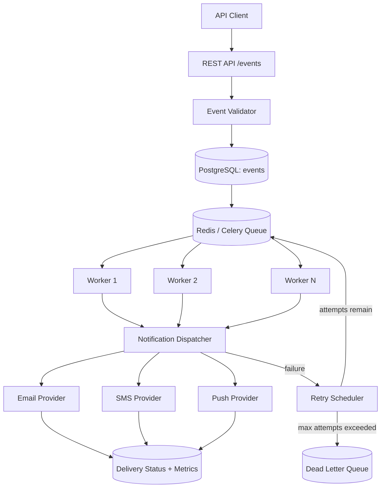
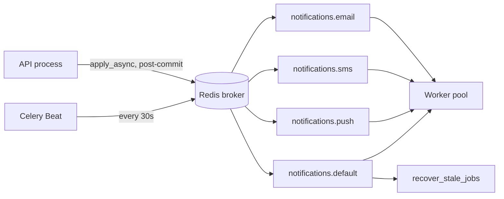
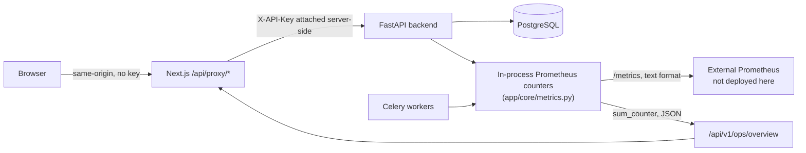

# Pulse — Architecture

## Overview

Pulse accepts application events over a REST API, persists them durably,
and asynchronously delivers notifications through one or more channels
(email, SMS, push). The asynchronous boundary between "event accepted"
and "notification delivered" is the core of the design — the API never
blocks on a downstream provider.

## State machines

Event and job states are closed enums (`app/core/states.py`), each with an
explicit transition table. A worker or API handler that attempts an
invalid transition (e.g. `DELIVERED -> QUEUED`) raises
`InvalidStateTransition` immediately rather than writing a state the rest
of the system doesn't know how to interpret.

**Event** (`events.status`): `RECEIVED -> VALIDATED -> QUEUED -> PROCESSING
-> DELIVERED`, or `-> FAILED -> DEAD_LETTERED` on the failure branch.

**Job** (`notification_jobs.status`, one row per event×channel):
`PENDING -> QUEUED -> PROCESSING -> DELIVERED`, or
`-> FAILED -> RETRYING -> QUEUED` (looping) `-> DEAD_LETTERED` once
`attempt_count >= max_attempts`.

## Idempotency

Two independent layers, deliberately redundant:

1. **`events.event_id` UNIQUE constraint.** A duplicate event submission
   fails at insert time with an `IntegrityError`, which the API layer
   translates into a `409 Conflict` pointing at the existing event. This
   closes the race window that an application-level
   `if event_exists: return` check leaves open under concurrent requests.

2. **`notification_jobs (event_id, channel)` UNIQUE constraint.** Job
   creation is idempotent per channel. Combined with workers claiming
   rows via `SELECT ... FOR UPDATE SKIP LOCKED`, two workers racing on the
   same queued job never both succeed in moving it to `PROCESSING` — one
   gets the lock, the other skips to the next available row.

This is what the concurrency test in `tests/integration` exercises
directly: N workers started against the same job, asserting exactly one
`notification_deliveries` row with status `DELIVERED`.

## Retry & dead-letter

Retry behavior is defined once, as data, in `app/core/retry_policy.py`
(`RetryPolicy` dataclass: max attempts, base delay, multiplier, jitter),
looked up per channel rather than hardcoded at each failure call site.
When `attempt_count` reaches `max_attempts`, the job transitions to
`DEAD_LETTERED` and a row is written to `dead_letter_jobs` with a
snapshot of the payload and failure reason — the original job stays
queryable, and a DLQ retry (`POST /dead-letter/{id}/retry`) re-enters the
job at `QUEUED` under normal processing rather than bypassing the state
machine.

## Why Celery + Redis

Celery provides task retry/backoff scheduling, DLQ-style failure
handling primitives, and per-queue worker concurrency out of the box.
Building an equivalent from a raw Redis list would mean re-implementing
the exact reliability primitives this project sets out to demonstrate.
Redis also backs the distributed rate limiter (Phase 4), so it was
already a required dependency rather than an added one.

## Celery architecture & queue topology (Phase 3)

One queue per channel (`notifications.email`, `.sms`, `.push`) plus a
`notifications.default` queue for the recovery task — a burst on one
channel can't starve the others, and per-channel worker scaling is
possible later without code changes. Routing is decided per-message at
enqueue time (`app/workers/dispatch.py`'s `queue_for_channel`), not via
static Celery `task_routes`, since the same task function handles every
channel.

`app/workers/celery_app.py` is the only place Celery itself is
configured — the FastAPI process never imports it eagerly (only
`app/workers/dispatch.py`, which lazily imports the task module inside a
function), so the API can start even before Redis/Celery are healthy.

Key Celery settings and why: `task_acks_late=True` +
`task_reject_on_worker_lost=True` mean a message is only removed from
Redis after the task returns — a worker that dies mid-task causes
redelivery instead of silent job loss. `worker_prefetch_multiplier=1`
caps each worker process to one unacked task at a time; a higher value
would let a crashed worker take several jobs down with it before
redelivery kicks in. Both choices trade some throughput for correctness.

## Enqueue timing & the at-least-once guarantee

Jobs are enqueued to Celery **after** the event/job transaction commits,
never before — enqueueing first risks a worker claiming a job whose
transaction then rolls back. This leaves a real, deliberately
undisguised failure window: if the process crashes or Redis is briefly
unreachable between the commit and the enqueue call, a job can sit
`QUEUED` in Postgres with no Celery message ever published for it.
`app/services/event_service.py` catches and logs that failure rather
than failing the HTTP response (the event *did* commit successfully).

`app/workers/recovery.py` runs every 30s via Celery Beat and closes this
window: any `QUEUED` job with no `claimed_at` older than 60 seconds is
re-published. The same sweep also requeues jobs stuck in `PROCESSING`
past an expired lease (see below).

**Pulse provides at-least-once job processing, not exactly-once.** A
task can be delivered more than once (Celery redelivery, or the recovery
sweep republishing something that was actually already in flight).
Correctness therefore comes from the database, not from trusting a
message is delivered exactly once:

- Job claiming uses `SELECT ... FOR UPDATE SKIP LOCKED` filtered to
  `status IN (QUEUED, RETRYING)`. Two concurrent claims of the same job
  ID resolve one of two ways — one wins the row lock and the other's
  `SKIP LOCKED` query returns nothing, or the first claim has already
  committed the status change to `PROCESSING` by the time the second
  query runs, so the status filter itself excludes it. Either way,
  exactly one claim proceeds.
- Recording an outcome re-checks `status == PROCESSING` before writing
  anything; a duplicate/late execution that finds the job already moved
  on writes nothing and logs a skip.

## Crash recovery

A worker can die between claiming a job (`status = PROCESSING`) and
recording its outcome. `notification_jobs.claimed_at` /
`lease_expires_at` (Phase 3 migration `0002`) back a lease: claiming a
job sets a 5-minute lease; `recover_stale_jobs` resets any job still
`PROCESSING` past that lease back to `QUEUED`. This is a lease/sweep
design, not a distributed lock — deliberately, since a full lock manager
would be the "unnecessary abstraction" this project's brief warns
against, and a periodic sweep is sufficient at this scale.

## Provider call boundary

Provider calls never happen inside an open Postgres transaction. The
flow is: **commit** claim (short transaction) → call provider (no
transaction open) → **commit** the outcome (short transaction) →
separately recompute the parent event's aggregate status. A slow or
hanging provider call therefore never holds a database row lock.

## Rate limiting

Redis-backed token bucket, one bucket per channel (`rate_limit:email`,
`rate_limit:sms`, `rate_limit:push`), implemented in
`app/core/rate_limiter.py`.

**What's limited**: one token = one provider-send attempt for a single
notification job. Limits are global per channel (capacity/minute from
the existing `rate_limit_*_per_minute` settings — these hooks existed
unused since Phase 1), not per-tenant or per-API-key; Pulse has one API
key today, so a tenant dimension would be unused complexity.

**Algorithm**: a continuously-refilling token bucket, not a fixed
window. A fixed window ("reset a counter every 60s") allows up to 2x the
configured limit in a burst straddling two window boundaries; a token
bucket refilling at `capacity/60` tokens/second has no such edge case
and maps directly onto "N per minute." The read-refill-compare-write
cycle runs as a single Redis Lua script (`EVAL`), which Redis executes
to completion without interleaving other commands — this is what makes
it safe across multiple API/worker processes calling it concurrently; a
plain GET-then-SET from Python would race between the two calls under
exactly the load this exists to handle.

**Where the check happens**: before any database transaction opens, not
inside the job-claiming transaction. The Celery task now receives
`channel` as an explicit argument (not just `job_id`), specifically so
this check can run first — checking Redis while holding a Postgres row
lock would violate the same "no external call inside an open
transaction" principle established for provider calls in Phase 3.

**Denial behavior**: a rate-limited job is explicitly *not* treated as a
provider failure. It is left exactly as it was (`QUEUED` or `RETRYING`),
no delivery record is created, `attempt_count` is not incremented, and
`RetryPolicy` is never consulted. The same Celery task is simply
rescheduled after a short fixed delay (2 seconds — deliberately not the
`RetryPolicy` backoff schedule, and deliberately not immediate, which
would hot-loop against an exhausted bucket).

**Redis failure policy**: fail open. If Redis is unreachable, `allow()`
returns `True` rather than blocking all notification delivery on the
limiter's own availability — a deliberate choice, not an oversight. The
tradeoff: a Redis outage means a real operator safety net briefly
disappears; the alternative (fail closed) would mean a transient Redis
blip silently halts every outbound notification in the system, which is
judged worse here. A payment-authorization gate would likely make the
opposite choice — the right answer depends on which failure mode hurts
more for the system in question.

## Observability: metrics & logging

`/metrics` (Prometheus format, `app/core/metrics.py` + the handler in
`app/main.py`) exposes counters for events received, jobs processed/
delivered/failed/dead-lettered/retried, and rate-limit denials, plus
histograms for provider-call duration and end-to-end delivery latency.
Every counter/histogram is incremented at the exact point the underlying
event happens in `app/workers/tasks.py` / `app/services/event_service.py`
— none are backfilled, periodically invented, or estimated.

The one gauge, `pulse_queue_depth`, is computed by querying the database
fresh on every scrape (inside the `/metrics` handler itself), not
maintained as a running counter — an incrementally-updated queue-depth
counter could silently drift from reality (e.g. after a crash-recovery
requeue); querying it live cannot.

**Label cardinality** is deliberately bounded to `channel` (3 values),
`provider` (effectively bounded by channel), and `event_type` on the one
counter that has it. `event_id`, `job_id`, and `recipient` are never
used as labels — each would make that metric's series count grow
without bound as the system runs, the classic Prometheus cardinality
mistake. High-detail per-job information belongs in structured logs
(which already carry `job_id`/`event_id`), not in metric labels.

Structured logs (`structlog`, JSON) never include the API key or
provider send content — see `app/workers/tasks.py`'s `job_processing_attempt`
log line for what a lifecycle log actually contains: `job_id`,
`channel`, `attempt`, `provider`, `status`, `duration_ms`, `error`.

## Bugs found during Phase 4 audit

Two real correctness bugs were found by re-reading the Phase 2/3 code
(not by running it — see [Runtime Verification](../README.md#runtime-verification)
in the README for why runtime execution wasn't possible in the
environment this was written in):

**Cross-event-loop connection reuse.** `app/db/session.py`'s `engine`
is a module-level singleton created once at import time. Every Celery
task in `app/workers/tasks.py` (and the recovery sweep in
`app/workers/recovery.py`) runs its own body via `asyncio.run(...)` — a
brand-new event loop per invocation. asyncpg ties a connection to the
event loop that created it; a connection checked into the shared pool
during task A's loop is not valid once that loop closes, so task B (a
different loop) attempting to reuse it would fail with a cross-event-loop
error. This would have manifested as intermittent worker failures
roughly every other task, in production, despite passing code review.
Fixed by disposing the engine's pool (and the rate limiter's Redis
client, which has the identical problem) at the end of every task's
event loop — see `_run_and_dispose` in both worker modules. The same
fix was applied to the test suite's shared engine, since pytest-asyncio
gives each test function its own event loop by default too.

**Enum value vs. name mismatch** (found during Phase 2, documented
there, restated here for completeness): SQLAlchemy's `Enum` column type
defaults to storing a Python enum member's *name*, not its `.value` —
fixed via `values_callable` on every enum column.

## Event-level aggregation (partial success)

An event's `status` is recomputed from its jobs' current states after
every outcome (`app/workers/event_aggregation.py`):

| Job states | Event status |
|---|---|
| all `DELIVERED` | `DELIVERED` |
| any `DEAD_LETTERED` | `FAILED` |
| all still `QUEUED` | `QUEUED` |
| anything else (in progress) | `PROCESSING` |

A dead-lettered channel immediately marks the event `FAILED` even if
sibling jobs already delivered or are still pending — once one channel
is permanently dead, the event as a whole will never fully succeed.
Individual job rows are never rewritten to make the aggregate look
better or worse; `DELIVERED` jobs stay `DELIVERED` even if the event
itself is `FAILED` because a sibling channel died.

This aggregation deliberately does **not** go through the event state
transition table in `app/core/states.py` — that table models the event's
own one-way lifecycle, while the aggregate is a many-to-one function of
N job states that can legitimately move in either direction as those
jobs change. It's recomputed idempotently on every job outcome rather
than incrementally, so it self-heals if two concurrent recomputations
briefly race (a known, accepted nuance — see Limitations).

## Operations dashboard (Phase 5)

**Two separate paths out of the same counters, on purpose.** `/metrics`
(Prometheus text exposition format) exists for a real monitoring stack
to scrape — Pulse ships the instrumentation, not a deployed Prometheus
server. `/api/v1/ops/overview` exists because the dashboard needs
structured JSON, not a text-format parser in the browser; it reads the
literal same `Counter`/`Gauge` objects via `metrics.sum_counter()`
(`.collect()`, the public API, not private internals) rather than
maintaining a second, independently-incremented count that could drift
from the real one.

**Auth boundary.** Pulse has one static API key and no per-user
identity. `frontend/app/api/proxy/[...path]/route.ts` is a Next.js
server-side route that holds `PULSE_API_KEY` (server-only env var, never
`NEXT_PUBLIC_`) and attaches it when forwarding browser requests to the
backend. The browser talks only to this Next.js server, same-origin,
and never sees the key. This is deliberately scoped as "good enough for
one operator," not a speculative multi-tenant auth system — a real
multi-operator deployment needs a session/identity layer in front of
this proxy, which does not exist here.

**Polling, not push.** Both pages that auto-refresh (Overview,
Observability) poll every 15 seconds via `lib/usePolling.ts`. The
backend's own data sources are already pull-based — Prometheus counters
are scraped, the ops-overview query is a point-in-time read — so a
WebSocket/SSE layer would mean building a second distributed subsystem
solely to push data that is itself only ever computed on demand.

**Never-collapse-the-states discipline.** `lib/api.ts`'s `ApiResult<T>`
type forces every caller to handle three outcomes separately: `ok`
(real data), `unavailable` (backend/proxy unreachable — the proxy itself
detects a failed `fetch` and returns a distinguishable `503` with code
`BACKEND_UNREACHABLE`), and `error` (backend responded with a 4xx/5xx).
None of these default to a `0` or an empty table — that would be
indistinguishable from "the system is healthy and idle," exactly the
misleading-observability failure mode this phase's brief warns against.

**Two real bugs found while wiring the dashboard, before any of it
could be run:**

1. `JobSummary` (embedded in `EventResponse.jobs`) had no `job_id`
   field — the event detail view would have had no way to link to a
   job's full delivery history. Added the field to the schema and both
   construction sites in `app/services/event_service.py`.
2. `DeadLetterItem.event_id` and `DeadLetterRetryResponse.event_id` were
   set to `NotificationJob.event_id` directly — which is the *internal
   UUID foreign key* to `events.id`, not the human-readable business key
   (e.g. `"evt_01HXYZ"`) that `GET /api/v1/events/{event_id}` actually
   looks up by. Every "view event" link from the dead-letter view would
   have silently 404'd. Fixed by joining through to `Event` and exposing
   `Event.event_id` instead; a regression test asserts the two values
   are actually different, not just present.

## Bugs and gaps found during Phase 6 audit

Four real issues found by re-reading the code — not by running it (see
the README's Runtime Verification warning):

1. **The API process never configured structured logging.**
   `configure_logging()` was only ever invoked via Celery's
   `worker_process_init` signal, so every `structlog.get_logger()` call
   made from request-handling code (e.g. the enqueue-failure logging in
   `app/services/event_service.py`) used structlog's out-of-the-box
   default renderer instead of the documented JSON format. Fixed by
   calling `configure_logging()` at the top of `app/main.py`.
2. **Missing `format_exc_info` processor.** The structlog processor
   chain had no way to render `exc_info=True` into a JSON-serializable
   field — any future `logger.error(..., exc_info=True)` call would have
   handed `JSONRenderer` a raw, non-serializable traceback tuple and
   failed at exactly the moment it mattered most. Added
   `structlog.processors.format_exc_info` to the chain.
3. **The generic exception handler never actually logged anything.**
   `app/main.py`'s catch-all handler had a comment claiming "real detail
   belongs in structured logs," but no logging call existed — an
   unhandled 500 in production would have been completely invisible to
   an operator, with the client-facing generic response as the only
   trace of it. Fixed by adding an explicit `logger.error(...,
   exc_info=True)` call (path and method only — never headers or body,
   which is exactly where an API key or notification payload would leak
   into logs). Covered by
   `tests/api/test_error_handling.py`.
4. **No Celery task time limits.** Irrelevant today (mock providers are
   synchronous and instant) but a real gap for whenever an actual
   HTTP-based provider is plugged in: a hung call could occupy a worker
   process indefinitely. Added `task_soft_time_limit=120` /
   `task_time_limit=150`, both comfortably under the 5-minute job lease
   so a killed task's job is still reclaimed promptly by the recovery
   sweep regardless of which mechanism (lease expiry or a hard kill)
   actually ends it.

Also hardened without being bugs per se: both Dockerfiles now run as a
non-root user (previously ran as root by default), and `.gitignore`
gained `.env.local` / `.env.*.local` patterns — the frontend's actual
env filename, which a bare `.env` pattern does not match.

## What's simulated

Email/SMS/push providers (`app/providers/mock.py`) are deterministic
local mocks. They do not send anything externally — no real provider
integration is claimed anywhere in this project. Failure behavior
(`always_succeed` / `always_fail` / `fail_n_then_succeed`) is
configurable per instance and never random, so tests built on them never
flake.

## What's deferred to later phases

- Multi-tenancy / per-API-key rate limits: not implemented — see Rate
  limiting above for why this is a deliberate scope decision, not an
  oversight.
- Multi-operator dashboard auth: the proxy holds one shared API key; a
  real session/identity layer for multiple operators does not exist.
- Search-by-ID on the dashboard: event/job detail is reached by
  clicking through a list, not a direct lookup field.
- A real deployed Prometheus/Grafana stack: Pulse ships the
  instrumentation (`/metrics`) and a JSON snapshot view
  (`/api/v1/ops/overview`), not a monitoring stack itself.

## Known nuances (documented rather than hidden)

- **Event status lags slightly behind an in-flight job.** The aggregate
  is recomputed when a job's *outcome* is recorded, not when it's
  claimed — so an event can stay `QUEUED` for the duration of a job's
  processing rather than flipping to `PROCESSING` the instant a worker
  picks it up.
- **No row lock on the event during aggregation.** Two jobs of the same
  event finishing at nearly the same moment each trigger their own
  independent recomputation; in the rare case they race, the aggregate
  write is last-writer-wins rather than serialized. This is self-healing
  (the next job outcome recomputes from scratch) but is not a hard
  guarantee against a momentarily stale aggregate value.
- **Rate limiter fails open, not closed** — see Rate limiting above.
  During a Redis outage, per-channel throughput is effectively
  unbounded rather than blocked.
- **Dashboard counters reset on API process restart** — the
  `rate_limit_denied_*` fields in `/api/v1/ops/overview` reflect
  in-process Prometheus counters, not a durable historical total. The
  response includes `in_process_counters_note` explaining this, and the
  dashboard surfaces that note rather than hiding it.
- **This entire document describes intended, reviewed behavior that has
  not been executed** in the environment it was written in — backend or
  frontend. See the README's Runtime Verification section for exactly
  what was and was not actually run.
